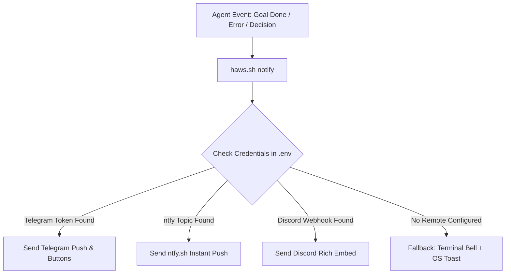

# Remote Notifications Strategy & Architecture Specification — HAWS v2.0

> **Status**: Strategic Blueprint & Concept Analysis  
> **Target Problem**: Notifying developers on mobile / remote devices during long-running autonomous AI tasks, overnight goals, or critical human-in-the-loop decision checkpoints.  
> **Location**: `docs/REMOTE_NOTIFICATIONS.md`  

---

## 1. Executive Overview & Problem Statement

Autonomous agentic workflows (such as `/goal`, multi-stage refactoring, comprehensive test suite runs, or repository audits) can execute unattended for 15 to 90+ minutes. During these execution windows, the human architect is frequently away from the keyboard (AFK), attending to other duties, commuting, or resting.

Without an automated remote notification mechanism:
1. **Idle Waste**: When the agent finishes early, hours of productive iteration time are lost while the human assumes the task is still running.
2. **Blocked Workflows**: When the agent hits a high-stakes decision checkpoint (e.g. database schema migration, destructive git operation, or scope clarification), execution halts until the human returns to inspect the terminal.
3. **Unnoticed Failures**: If a build fails at step 2 of a 10-step pipeline, the entire night is wasted on an early failure.

---

## 2. Comprehensive Comparison of Remote Notification Protocols

| Service / Protocol | Setup Complexity | Cost | Mobile Push (iOS/Android) | Interactive Buttons (Two-Way) | Security & Privacy | HAWS Recommendation |
| :--- | :---: | :---: | :---: | :---: | :---: | :---: |
| **Telegram Bot API** | ⭐⭐ (Low, 2 mins) | Free (Unlimited) | 🟢 Excellent (Instant, custom sounds) | 🟢 Yes (Inline Keyboard Buttons) | 🟢 High (Token + Chat ID lock) | 🏆 **Top Pick (Pair Programming)** |
| **ntfy.sh** | ⭐ (Zero-signup, 30s) | Free / Open Source | 🟢 Excellent (Native App) | 🟡 Action Links (URL / Webhook) | 🟡 Medium (Topic-based / Self-hostable) | 🥈 **Top Pick (Zero-Friction)** |
| **Discord Webhook** | ⭐ (Low, 1 min) | Free | 🟡 Moderate (Easily muted/buried) | 🔴 No (One-way webhook only) | 🟢 High (Channel Webhook URL) | 🥉 **Great for Team Channels** |
| **Pushover** | ⭐⭐ (Low, 3 mins) | $5 one-time app fee | 🟢 Outstanding (Bypasses DND) | 🔴 No (One-way push only) | 🟢 High (User/App Key) | 🚨 **Best for Emergency Paging** |
| **LINE Notify** | ❌ **DEPRECATED** | — | — | — | — | ⛔ **DO NOT USE (Shutdown March 2025)** |
| **LINE Messaging API** | ⭐⭐⭐⭐ (High, 15 mins) | Free Tier (Limited) | 🟢 Good | 🟢 Yes (Rich Menu / Flex Msg) | 🟢 High (SSL Webhook Server needed) | ⚪ Optional for Thai enterprise |

---

## 3. Deep-Dive Analysis of the Top Solutions

### 🏆 Solution 1: Telegram Bot API (The Recommended Champion)
- **Why it wins**: Telegram offers the perfect balance between zero cost, instant mobile delivery, rich MarkdownV2 formatting, and **two-way interactive control**.
- **Interactive Capabilities**:
  When HAWS pauses at a checkpoint (e.g. after running `haws.sh doctor`), the Telegram bot can send an alert with inline buttons directly to your smartphone:
  ```text
  [HAWS ALERT] All 27 Checks PASSED (100% Green)
  Commit: 1bbb951 ready on branch feat/haws-comprehensive-improvement
  
  [ Merge to Main ]  [ View Diff ]  [ Discard ]
  ```
  Tapping a button sends an instant callback payload that can resume or abort the agent task without touching your laptop.
- **One-Liner Bash Implementation**:
  ```bash
  curl -s -X POST "https://api.telegram.org/bot${TELEGRAM_BOT_TOKEN}/sendMessage" \
    -d "chat_id=${TELEGRAM_CHAT_ID}" \
    -d "text=🚀 *[HAWS GOAL COMPLETE]* All tests passed (27/27 green)." \
    -d "parse_mode=Markdown"
  ```

---

### 🥈 Solution 2: ntfy.sh (The Zero-Friction Champion)
- **Why it is attractive**: Requires **no bot registration, no API tokens, and no account signup**.
- **How it works**:
  1. Install the `ntfy` app on your iOS or Android device.
  2. Subscribe to a secret, unique topic name (e.g. `ntfy.sh/haws-alert-boom-9842`).
  3. Send notifications with a single HTTP POST request:
     ```bash
     curl -H "Title: HAWS Build Complete" \
          -H "Priority: high" \
          -H "Tags: white_check_mark,rocket" \
          -d "Diagnostics passed 100%. Ready for your review." \
          https://ntfy.sh/haws-alert-boom-9842
     ```
- **Self-Hosting**: If sending notification content through public servers is a privacy concern, `ntfy` can be deployed locally in 1 Docker command on a personal VPS or home server.

---

### 🥉 Solution 3: Discord Webhooks
- **Ideal For**: Workspaces that already have a dedicated personal Discord development server.
- **Features**: Rich embeds with colored sidebars (Green `#22c55e` for pass, Red `#ef4444` for fail), field grids for metrics (Token Count, Doctor Score, Execution Time).
- **Limitation**: Discord mobile notifications frequently get grouped or muted. Two-way interaction requires running a persistent Node.js or Python Discord bot process.

---

## 4. Proposed HAWS Notification Gateway Design (`haws.sh notify`)

To preserve HAWS's minimalist, zero-bloat philosophy (Ponytail Rung 2–3), we design a unified notification engine embedded directly into `haws.sh`:



### Notification Payload Standard

Every notification must adhere to structured metadata:
1. **Title**: `[HAWS <STATUS>] <Brief Topic>` (e.g. `[HAWS COMPLETE] Task Plan 100% Green`)
2. **Priority**: `normal`, `high`, or `urgent` (urgent bypasses quiet hours)
3. **Execution Metrics**:
   - Elapsed wall-clock time
   - Doctor Diagnostics score (`27/27`)
   - Active Git branch and short commit hash
4. **Actionable Link / Command**: Exact command to resume or inspect.

---

## 5. Security & Privacy Guardrails

1. **Strict Credential Isolation**:
   - Secrets (`TELEGRAM_BOT_TOKEN`, `DISCORD_WEBHOOK_URL`, `PUSHOVER_KEY`) must live exclusively in `.env`.
   - **Hardware-Level Protection**: Our newly implemented `.githooks/pre-commit` hook permanently guarantees that `.env` cannot be accidentally committed to git.
2. **Sanitized Payloads**:
   - Notifications must never include raw secrets, `.env` values, full API keys, or private customer data in message bodies. Only aggregate counts and file basenames are emitted.
3. **Topic Obfuscation (for ntfy.sh)**:
   - When using public `ntfy.sh`, the topic name must use a cryptographically random slug (e.g. `ntfy.sh/haws-7d9a4e8f1b2c3d4e`) rather than a predictable username to prevent eavesdropping.

---

## 6. Implementation Roadmap & Next Steps

- **Phase 2.1 (Current)**: Architecture & Comparative Analysis completed and documented in `docs/REMOTE_NOTIFICATIONS.md`.
- **Phase 2.2 (Tooling)**: Implement `haws.sh notify "<title>" "<message>" [priority]` supporting Telegram, ntfy.sh, and local fallback.
- **Phase 2.3 (Interactive Callback)**: Scaffold lightweight webhook receiver script (`scripts/notify_receiver.mjs`) enabling smartphone approval buttons to trigger `git merge` or continuation loops.
