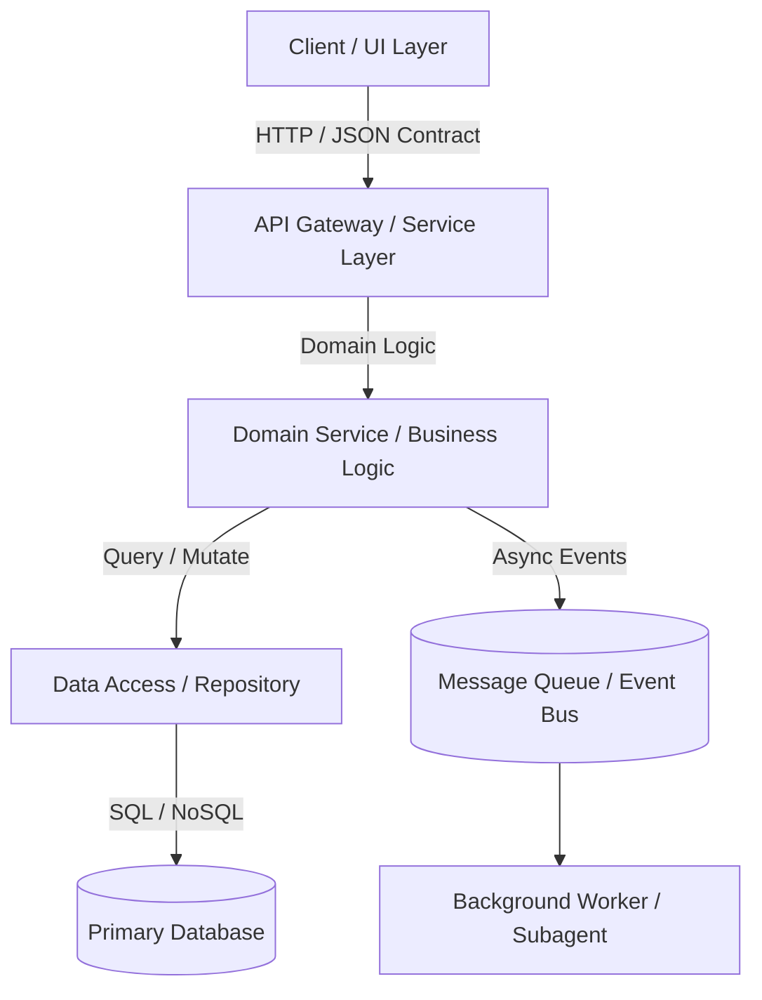

# System Architecture Specification — [System / Project Name]

## 1. Overview & Problem Statement
- **Context & Problem**: What is the current problem and why is this system needed?
- **Goals**: What must this system accomplish? (Expected measurable outcomes)
- **Non-Goals**: What is explicitly out-of-scope to prevent scope creep?

## 2. Architecture Topology & Component Boundaries
- **High-Level Architecture**: System topology, relationships, and component interactions.
- **Visual Diagram (Mermaid)**:

- **Component Responsibilities**:
  - **Client / UI Layer**: Views, user state, client-side rendering, and accessibility.
  - **API / Service Layer**: Domain logic, business workflows, authentication, and validation.
  - **Persistence Layer**: Database models, migrations, caching, and storage.

## 3. Machine-Readable Architecture Graph (Archify IR)
*Optional for complex systems: generate or synchronize an `archify.json` graph representation for automated validation and agent navigation.*
```json
{
  "$schema": "https://raw.githubusercontent.com/tt-a1i/archify/main/schema.json",
  "name": "System Architecture Graph",
  "version": "1.0.0",
  "nodes": [
    { "id": "ui", "name": "Frontend Web App", "type": "client", "boundary": "public" },
    { "id": "api", "name": "REST API Gateway", "type": "service", "boundary": "internal" },
    { "id": "db", "name": "PostgreSQL Database", "type": "datastore", "boundary": "isolated" }
  ],
  "edges": [
    { "source": "ui", "target": "api", "protocol": "HTTPS", "payload": "JSON" },
    { "source": "api", "target": "db", "protocol": "TCP", "payload": "SQL" }
  ]
}
```

## 4. Data Contracts & Interfaces
- **Data Models / Schemas**: Entity definitions, database tables, or TypeScript interfaces.
- **API Contracts**: Endpoints, HTTP methods, request payloads, response structures, and status codes.

## 5. Error Handling & Resilience
- Validation fallbacks for missing or malformed inputs.
- Handling external service unavailability, network timeouts, and partial failures.
- Concurrency protection, transactional boundaries, and Pokayoke error-proofing.

## 6. Verification & Acceptance Criteria
- **Definition of Done**: Criteria confirming production readiness.
- **Testing Strategy**: Unit tests, integration tests, boundary checks, and regression verification.

